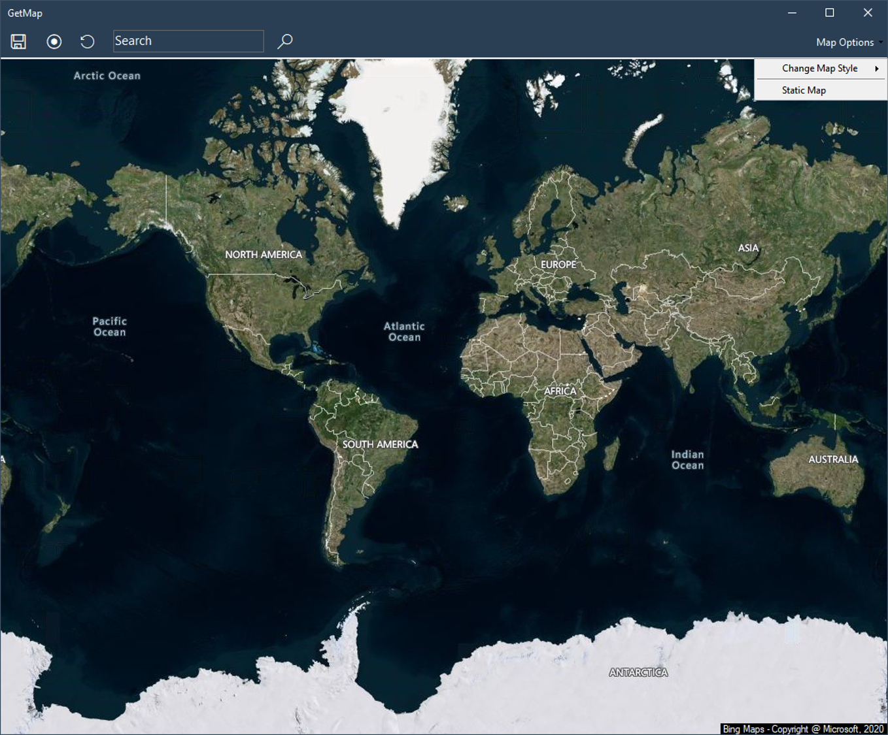
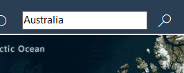

# ipLocnTest
Get decently featured maps in .NET, without any actual mapping API involved in your end!

  

- Supports Satellite view (with and without labels) and Regular view (with labels).
- Default Draggable (Through left mouse button) and Zoomable (Through Scroll Wheel), But also provides static mode (higher resolution) (with buttons for zoom, etc)
- Navigates to given coordinates
- Supports Geolocation (PS: sometimes it doesn't work on the first try)(also your location should be on)
- Saves image directly to your desktop

## Latest Additions
<ul>
  <li> 🆕 Now you can search for countries too, along with the regular coordinate search.
</ul> 

  

 
<ul>
  <li>Added circular Navigation controls for static map. 🆕 <i>Now they are dark.</i>
</ul> 

  

 
<ul>
<li>🆕 Menu items now have icons.
</ul> 

  

<ul>
<li> Improved zoom in static map. 
<li> Added Navigation hints to toolbar. 
<li> Minor design change. 
<li> Added search tip.
</ul> 

## Geolocation - example

    Imports System.Device.Location

Put following code inside main class

    DIm n = 0
    Private Sub Watcher_StatusChanged(ByVal sender As Object, ByVal e As GeoPositionStatusChangedEventArgs)
        n += 1
        If e.Status = GeoPositionStatus.Ready Then
            If Watcher.Position.Location.IsUnknown Then
                txtlat = "Cannot find location data"
            Else
                txtlat = Watcher.Position.Location.Latitude.ToString() '.Substring(0, 7)
                txtlong = Watcher.Position.Location.Longitude.ToString() '.Substring(0, 7)
            End If
        End If
        If n < 10 Then
            If txtlat <> "Cannot find location data" And Math.Abs(Val(txtlat)) > 0.0000001 Then
                Watcher.Stop()
                'the value of txtlat and txtlong has now been set to your location
            End If
        Else
                Watcher.Stop()
               'give user some indication of error/ handle the error (thrown when cannot find location)
        End If
    End Sub
    Private Sub LocateMe()
        n = 0
        Watcher = New GeoCoordinateWatcher()
        AddHandler Watcher.StatusChanged, AddressOf Watcher_StatusChanged
        Watcher.Start()
    End Sub

Call the LocateMe() sub when you require the location. For first use, a messagebox will pop up asking for permission to access location.
The values of txtlat and txtlong will be set to the latitude and longitude.  
<b>Note that this is usually not instantaneous, and <i>may</i> fail on the first try</b>
