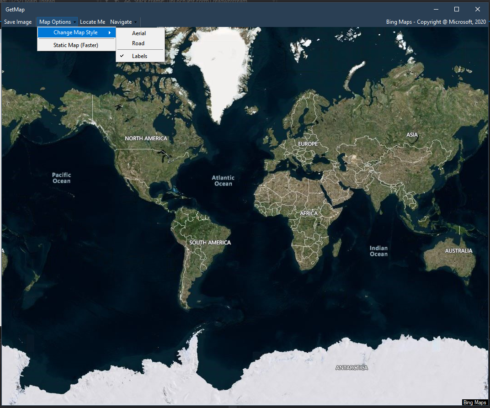

# ipLocnTest

  

- Supports Aerial and Regular view with and without labels (Regular view with labels only).
- Default Draggable and Zoomable (Through Scroll Wheel), But also provides static mode (higher resolution) (with buttons for zoom, etc)
- Navigates to given coordinates
- Supports Geolocation (PS: sometimes it doesn't work on the first try)(also your location should be on)

## Geolocation - example

    Imports System.Device.Location
    Dim txtlat As string,txtlong as string
    Private Sub LocateMe()
         Watcher = New GeoCoordinateWatcher()
         AddHandler Watcher.StatusChanged, AddressOf Watcher_StatusChanged
         Watcher.Start()
    End Sub
    Private Sub Watcher_StatusChanged(ByVal sender As Object, ByVal e As GeoPositionStatusChangedEventArgs)
        If e.Status = GeoPositionStatus.Ready Then

            If Watcher.Position.Location.IsUnknown Then
                txtlat = "Cannot find location data"
            Else
                txtlat = Watcher.Position.Location.Latitude.ToString() '.Substring(0, 7)
                txtlong = Watcher.Position.Location.Longitude.ToString() '.Substring(0, 7)
            End If
        End If       
        If Val(txtlat) > 0 Then
            Watcher.Stop()
        End if
    End Sub        
Call the LocateMe() sub when you require the location. For first use, a messagebox will pop up asking for permission to access location.
The values of txtlat and txtlong will be set to the latitude and longitude.
 Note that this is usually not instantaneous, and *may* fail on the first try
